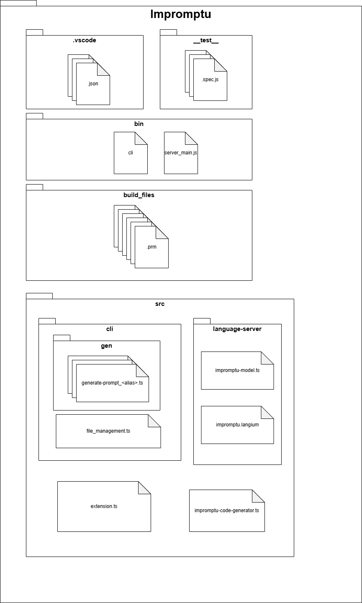
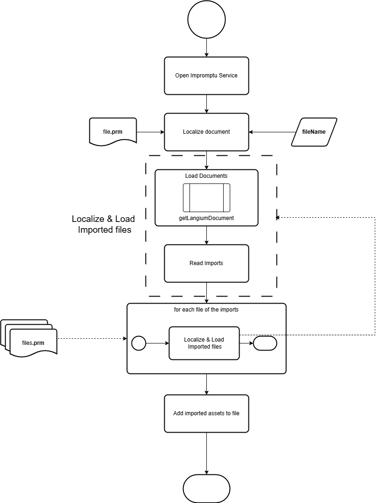
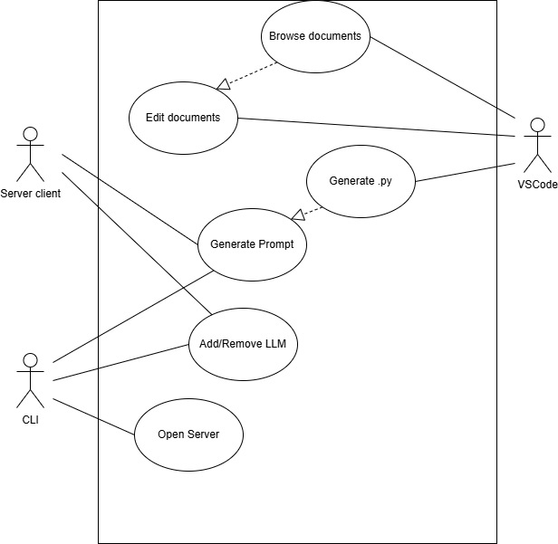
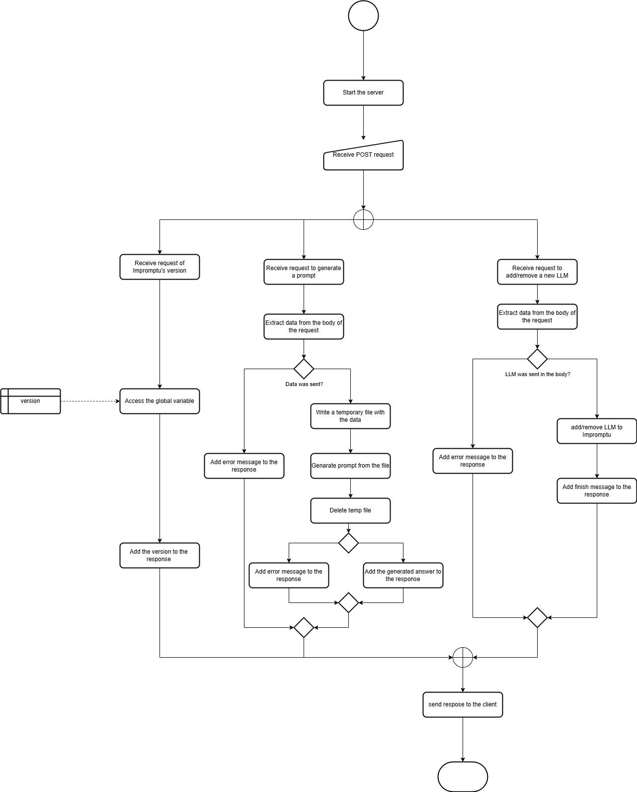
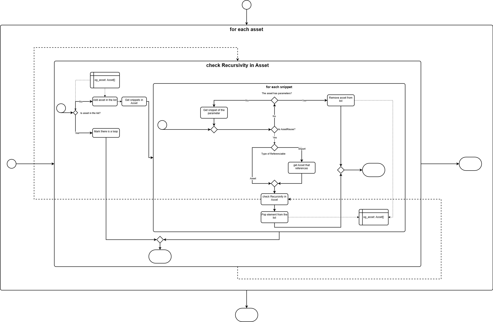
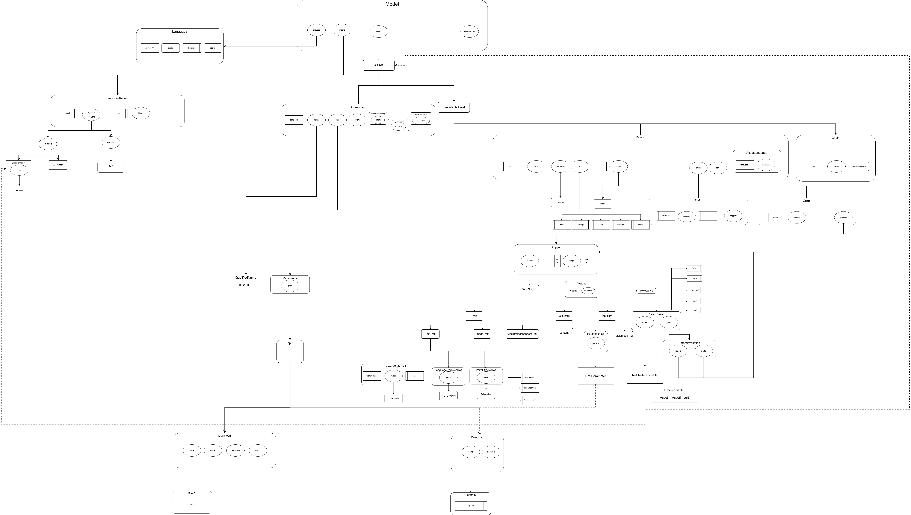

### Table of contents
**[Introduction](#introduction)** 
- [Project Overview](#project-overview)
- [Prerequisites](#prerequisites)

**[Getting Started](#getting-started)**

**[Project Structure](#project-structure)**

**[Core Concepts](#core-concepts)** 
- [Functions](#functions)
    - [Prompt generation](#prompt-generation)
    - [Adding/Deleting a custom generator for a LLM](#addingdeleting-a-custom-generator-for-a-llm)
- [Modes](#modes)
    - [Server's mode](#servers-mode)
    - [CLI's mode](#clis-mode)
    - [Vscode Extension](#vscode-extension)
- [Impromptu's modules](#impromptus-modules)
    - [Scoping](#scoping)
    - ['*' import implementation](#-import-implementation)
    - [Validators](#validators)
   
- [Arquitecture](#architecturer)
    - [Impromptu's Arquitecture](#impromptus-architecture)
- [Data Flow](#data-flow)

**[Coding Guidelines](#coding-guidelines)** 
- [Error Management](#error-management)

**[Testing and Debugging](#debugging)** 
- [Debugging](#debugging)
    - [VSCode Extension](#vscode-extension)
    - [CLI & Server mode](#cli--server-mode)
- [Testing](#testing)

**[Developing Workflow](#developing-workflow)**
- [Commit Workflow](#commit-guidelines)
- [Troubleshooting](#troubleshooting)
- [Known Errors](#known-errors)

**[License](#license)**

**[Appendices](#appendices)**


# Introduction

## Project Overview
Impromptu is a Language Server Protocol (LSP) that defines the structure  of `.prm` files. Those file are used as scripts to generate prompt commands (in a `.txt` format, or inside a `.py` script) to use in a LLM.

An user can command that action by CLI command, open an Impromptu server and send a request to it, or using the VSCode extension. With this last option, the user can edit and validate the `.prm` scripts as well.

As Impromptu is base on typescript and Node, the most ofits files are written in typescript, from the proccess of grenerating the prompt from the `.prm` file, to Impromptu's syntaxt itsself. Howver, the script that defines the grammar of the LSP is a `.langium` script, which structure is mix between regular expressions and typescript-

In addition of generating the prompts, there are other functionalities, such as providing new scripts that customizes the generation of prompts for a certain LLM.


## Prerequisites

- Typescript

- Node.js

- Have read Langium documentation

- Have read VSCode extension documentation

# Getting Started

See the file [StartUp.md](StartUp.md).


# Project Structure

The main folders that are important to the development of the application are:

- `__test__`, where are **located the unitary tests**. It is hidden. For more information, see the [Testing](#testing) section.
- `.vscode` Here are the json files that defines how the **vscode expansion** would behave, and the **debug options**.
- `bin`. Here are located the two "gates" to the Impromptu server.
- `build_files`. Here are located the `.prm` files.
- `src`. In this folder is located the core of the application, both its fuctionalities and Langium's files. Here are included:
    - `/cli/gen`. Folder where are located the files about **generating th prompts from the `.prm` files**.
    - `/language-server`. Folder where are located the files that **define the syntax and grammar of Impromptu**.
    - `/cli/file_management.ts`. File that manages the **modification of files in `/cli/gen`.**
    - `/extension.ts` and `/impromptu-code-generator.ts`. Files about running the **VSCode extension**.




# Core Concepts
In this section are explained the different functionalities of Impromptu, as well as the arquitecture of the Impromptu's files. When talking about the different functionalities and files, it will also be explain the main function and in which files are located.

## Functions
The main function of Impromptu is to generate the prompt of a `.prm` file written by the user. However, there are another important functionalities that Impromptu has, which would give the user several facilities to help in that matter.

### Prompt generation
As it was said about, the main goal of Impromptu is to generate a prompt using a `.prm` file. Several parameter can be declared so that the prompt is adapted to a certain LLM, or indicating where the response file is created.

#### `generate-prompt.ts`
In this file is located the code that gets the prompt based on the file `.prm` given. The prompt is generated . It returns a `.txt` file with the generated prompt. It is connected with the files that generate the prompt for each LLM (such as `generate-prompt_ChatGPT.ts`). In case no LLM was declared, the prompt will be generated using the default protocol (`generate-prompt_default.ts`)
Those custom first files are based on `generate-prompt_default.ts`, but modify to adjust to the LLM. More custom generators can be created by the CLI command (`addLLM` link with it). The next section will be further explained.

The stucture of the custom files are adpated to each LLM but every one of them is based on `generate-prompt_default.ts`.

**Main functions:**

- `generatePrompt_default(model: Ast.Model, prompt: Ast.Prompt | undefined, variables?: string[]): string[]`
Launch function of generating a prompt. The input parameters are AST nodes (`model` and `prompt`), so itt needs that the AST of the `.prm` has been already built (done in `extractAstNode()` in `cli-util.ts`) wherever this function is used.

- `genAssetReuse(assetReuse: Ast.AssetReuse, aiSystem:string|undefined,  previousMap?:Map<string,string>): string`
Connects a reference of an asset with the original asset. Also, the variable mapping (transmitted in `previousMap`) is updated.

- `genImportedAsset(asset:Ast.AssetImport, aiSystem:string|undefined, variables?: Map<string,string>):string[]`
Link a reference of an imported asset to the imported asset, updating ath variable map in the process
> The function `genImportedAsset()` is common for both the custom route and the default one. The reason is that its function is only to connect the functions outside the file, and generate thir prompt in the required LLM (that is the reason why one of their arguments is the **aiSystem**).


#### `generate-prompt_default.ts`

In this file are located the functions that generates the prompt, in case a certain LLM was not declared. If a LLM was declared instead, the prompt will be generated in `generate-prompt_<alias>.ts` (i.e `generate-prompt_SD.ts` for StableDiffusion). 
Those files are based on `generate-prompt_default.ts`, but with certain modifications due to the prompt generated is adpated to the LLM where it will be used. 
Analysing the functions and structures of the default case grant general knowledge about the specific cases as well.

**Main functions**
- **`generatePrompt_default()`**. 
This function generates the prompt of all assets of a file . 

- **`genAsset_default()`**
The prompt of each Asset is generated by **`genAsset_default()`** (if a prompt was sent as argument, will only returns that asset). Depending of the type of asset, it will generate the prompt in one way or another, using the different **snippets** of the asset.


- **`genSnippet_default()`**
The prompt related that snippets is generated by `genSnippet_default()`. It is important to remark that some types of BaseSnippets refrence elements located outside the assets (ParameterRef,  AssetReuse, Imports, etc). For those cases, the scoping is modified so that can be referenced correctly.


#### `cli-utils.ts`

In this file there are multiple functions that offers multiple utilities for functions of the other files:

- `extractDocument()`. Creates the Langium Document of a docuement.
- `extractAstNode()`. Creates AST tree of a `.prm` file. It mean that the LandiumDocument of the file and its imports has to be created.


- `extractDestinationAndName()`. Manage the creation of the `.txt` with the generated prompt.
 - `get_imported_asset` (Deprecated).
- `get_line_node()` Gets the line of an asset (Used to communicate errors to the user).
- `get_file_from()` (FilePathData interface) Gets the file of a certain asset (maybe deprecated)
- `getLanguage()` Get the Language of the document


### Adding/Deleting a custom generator for a LLM

Impromptu has the option to create/delete a `.ts` file so that the prompt generation for a certain LLM is specific.  See [adding extra LLMs](README.md#adding-extra-llms). Those operations are accesible by CLI and server requests, and their code are located in `file_management.ts`.

Those custom files are created from `generate-prompt_default.ts`. In fact, they are based on the hidden file `generate-prompt_base.ts`* that is a modification of `generate-prompt_default.ts`. In addition of generating/removing the new file, the `gen/generate-prompt.ts` file is modified so that it adapts to the consider the new configuration.-


This file is generated by creating a copy of the file `gen/generatic-prompt_base.ts`, which **is hidden by default**. 
> In order to visualize it in the vscode editor, the user must first change the `-vscode/settings.json` file and change `"__test__: true"` to `"__test__: false"`. 

#### `file_management.ts`


**Main functions:**
- **`addLLM`** Creates a custom prompt generator to the wanted LLM. It also modify `generate-prompt.ts` and add it to the JSON that stores the LLM with a custom generation.
- **`removeLLM`** Opposite procedure to `addLLM`.

</img>
[Full image](./pictures/AddLLM.drawio.png)


## Modes
Impromptu's modes are the different ways one can access the different Impromptu's functionalities. The mode choosen to use Impromptu will depend of how the user will want to use Impromptu. Depend of the mode chosen, the different functionalities talked before are accesible or not.




### Server's mode

In the **server's mode**, a Node server is open so that you can access to the Impromptu's functionalities from the client by sending POST request. Those request are managed in `bin/server_main.js` [these section](#bin), were the server is open and solve the request by connecting with the specific function in `src/bin` that execututes the wanted command (adding a new LLM, generate a prompt, etc).


</img>


#### `server_main.js`
 Initialize the node server and define the different POST request the server accepts. That functions will call another functions in other files that the other modes will call as well. For example, the POST request of generating a prompt, will (after load the required Langium Documents) call `generatePromptCode()` in `src/cli/gen/generate_prompt.ts`.

### CLI's mode

Other option to interact with Impromptu is by sending command in the Command Line. In this case, the endpoint is `bin\cli`, and it connects with `src/cli/index.ts`, where are described all the command that Impromptu allow. See [CLI node and prompt customization](/README.md#cli-mode-and-prompt-customization).

#### `main.ts`
Starts the language server.

#### `index.ts`
Here are declared the different CLI commands that Impromptu accepts, and their functionalities. The different CLI commands are declared as `Command` objects, for example:
```
 program
        .command('genprompt')
        .argument('<file>', `source file (possible file extensions: ${fileExtensions})`)
        .option('-d, --destination <dir>', 'destination directory of generating')
        .option('-p, --prompt <prompt>', 'Prompt where the varaibles are used')
        .option('-v, --variables <var...>', 'arguments transmitted to the prompt')
        .option('-t, --target <name>', 'name of the target generative AI system that will receive the prompt')
        .description('Generate the textual prompt stored in a given file')
        .action(generatePromptAction);
```

**Main functions**

`generatePromptAction(fileName,opts)`
Generate a prompt from the file transmitted ([prompt generation](#prompt-generation)).
 * `fileName` relative path of the `.prm` (string)
 * `opts` :
    * `destination` Name used in the file and files' fuctions i.e. `genPrompt_<alias>`
    * `target` LLM where the prompt will be used.
    * `prompt` If sent, the prompt it will be generated. If not sent, prompts of all assets in the file are generated instead.
    * `variables` values give to prompt's inputs.

`generateAll(folderName,opts)`
Generate the prompts of all files of a certain folder (`folderName`).
### VScode Extension

`version()`
    Returns Impormptu's version.

`addAI()` / `reomveAI()`
Creates/ Deletes and modify the files so that a new LLM generates/stops generating prompts uniquely ([Adding/Deleting a custom generator for a LLM](#addingdeleting-a-custom-generator-for-a-llm))


See [VSCode Extension](/README.md#vscode-extension)

#### `extensions.ts`
In this file are located functions that activates (`activate(context)`) and deactivates (`deactivate(context)`) the VSCode extension. 

The activation of the extension requieres of several stapes
- `startLanguageClient(context)` Start the debug server, and the client, inlcudind loading the elements in the UI
`generateCodeService(context,aiSystem)`. Load the service that generates the `.py` file with generated prompt.


#### `impromptu-code-generator.ts`

In this file is located the generation of the `.py` file. The main function in this file is `model2Code()`, that connects the VSCode extension with Impromptu's Code Generator.

## Impromptu's modules

In a Langium workspace, in the folder `src/language-server` are located the documents regarding the syntax and grammar of the language. The `.langium` file defines the grammmar, while in the typescript file `impromptu-module.ts` is defined the syntax of the language. Several modification have been done from the default Langium syntax, about the **validation** and **scoping** of it


### Scoping (`src/language-server/impromptu-scope.ts`)

The scope is key part of the Langium performance. It links the refrences in the AST tree with the nodes they reference. In Impormptu's case, there are some modification to the default scope that are necessary to the correct performances of the references in the `.prm` documents (more information [here](https://langium.org/docs/recipes/scoping/)).


One of the properties of Impromptu is the fact that you can use functions describe in other `.prm` files. In order to to be able to do that, we need to change the default scoping provided by Langium so that the imports can be linked with the asset or different files. 

The steps needed to archieve a correct scoping of items imported from another file, are:

- **Link the reference of the import with the import itself**. One has to declare the map of the name and the object manually, since the default scope of the AssetReuse does not see Assets/Imports(they are adove in the AST tree).This is done similarly to the ParameterRef and Inputs.

- **Reference the import with the original item in another file**. For do this correctly, and only look inside the imported file, one need to manage URIs, and add to the scope the item of those files. This is done using the `vscode\uri` package.


- Compute the exports so that the items can be referenciable outside of their own file properly. This is donde by forcing to **create the description of the assets during the scope computation phase**.


#### '*' import implementation

 Since in this case the asset are not refered in the ImportedAsset, **the scope has to be made directely between the AssetReuse and the Asset from the other file**, which imply that the elements we need are different from the previous case:

- Instead of the `AsseReuse` been linked to the `assetImport` which is linked to original Asset in the other file, is the `AsseReuse` which is connected with the original `Asset`. It is possible since the descriptions of the Asset are loaded in the scope computatrion phase
- This means that this is part of the `AssetReuse` Scope, where there are the description to the Inputs (`ParameterRef`) and Referenciables(other `Assets` or `ImportedAssets`)
-  We do not need extra scope computations, since we make use of the  description created to the simple case.

A similar implementation cab be found in the [file-based scoping example of the Langium Documentation](https://langium.org/docs/recipes/scoping/file-based/).

### Validators

Additionally, some modifications in Langium's Validators has had to be done as well. 

- `checkNoRecursivity(model,accept)` Check that the script do not have infinite loops. This is the most elaborated validators, and has to be done by using recursive functions.


- `checkAssetReuse()` Check that the number of inputs in an Asset and in its AssetReause match.
- `checkImportedAsset()` Check that the Imports are correct (the file and the prompt exists)

- `checkUniqueParams()`,  Check that the different elements does not share name with another object.
- `checkLanguagePrompt()`,`checkLanguageComposer()` Check that the language of an assest and an import is the same.

- `checkLanguage()`, `checkLanguage()` Check that the language used is accepted.


## Architecture
### Impromptu's Architecture
The file `impromptu-langium` defines how the semantic of a `.prm` script should be. That is done by defining different structures, and how they have to appear in a `.prm` to be wqell defined. 

The tree below represents this grammar, by denoting in **bold** the structures, and in *cursive* how thaty object is called.

When a structure is inside  another structure without a name (for example, **Input-Parameter**), it means that the structure inside is a **type of the bigger structure**, in a relationship similar to child - parent classes in O.O.P.


**Model**
- *language*
- *assets* (**Asset**[])
    - **Composer**
        - *name*
        - *pars*(**Input**[])
            - **Input**
                - **Parameter**
                    - *name*
                    - *description*
                - **Multimodal**
                    - *name*
                    - *format*
                    - *description*
                    - *weight*(**Weight**)
        - *contents*(**Snippet**[])
    - **ExecutableAsset**
        - **Prompt**
            - *name*
            - *description*
            - *pars*(**Parameter**[])
                - **Input**
                - **Parameter**
                    - *name*
                    - *description*
                - **Multimodal**
                    -  *name*
                    - *format*
                    - *description*
                    - *weight*(**Weight**)
            - *output* (**Media**): `'text' | 'image' | 'audio' | 'video' | '3dobject'`
            - *prefix* (**Prefix**)
                - *name* = `'prefix'`
                - *snippets* (**Snippet**[])
            - *core* (**Core**)
                - *name* = `'core'`
                - *snippets* (**Snippet**[])
            - *suffix* (**Suffix**)
                - *name* = `'suffix'`
                - *snippets* (**Snippet**[])
            - **AssetLanguage**
                - *language*: \<string> 
            - **AssetSeparator**
                - *separator*: \<string>

        - **Chain**
- *imports* (**ImportedAsset**[]):
    - **ImportedAsset**
        -  *set_assets* / *everyone*
            - *set_assets* (**AssetImport**[])
                - **AssetImport**
                    - asset (<u>*Ref <b>Asset</b>*</u>)

            - *everyone* = `'*'`
            
        - *library*: QualifiedName
-------
**Snippet**
- *content* (**BaseSinppet**)
    - **TextLiteral**
        - *content*
    - **InputRef**
        - **ParameterRef**
            - *param* (<u>*Ref <b>Parameter</b>*</u>)
        - **MultimodalRef**
            - *param* (<u>*Ref <b>Multimodal</b>*</u>)
    - **AssetReuse**
        - *asset* (<u>*Ref <b>Referenciable</b>*</u>)
        - *pars* (**ParamInvokation**)
            - *pars* (**Snippet**[])
    - **Trait** (*See more info in the [traits' cheat sheet](traits_cheat_sheet.md)*)
        - **TextTrait**
            - **LiteraryStyleTrait**
            - LanguageRegisterTrait
            - PointOfViewTrait
        - **ImageTrait**
            - MediumTrait
            ...
            - EffectsTrait
        - MediumIndependentTrait
            - RelativeTrait
            ...
            - ComparisonTrait

- *weight*(**Weight**)
    - *relevance* (**Relevance**) = `'min' | 'low' | 'medium' | 'high' | 'max'`

Scheme:

</img>
You can take a closer to the scheme in the [pictures/impromptu.drawio.png](pictures/impromptu.drawio.png) file.

## Data Flow

Depending of how do you access to Imporptu, you have access to certain functionalities or another.


# Coding Guidelines


### Error Management
The code that is implemented has to consider the option that the user does not give the data or does it with the worng format. There are two types of possible errors that it may occurr due to a wrong input: validation errors or compilation errors.
- <b>Validation errors</b>. These errors are related to errors of the Impromptu syntax in the Langium document. Therefore, they are detected before creating the AST.
- <b>Compilation errors</b>. There are another errors that are only detected when the prompt is being generated.

The formatting of how those errors have to be comunicated to the user following these format:
```
[<file>: <line>] Error: <description>
```
In case the **error occurs in a imported file**, that file and all their parents have errors. <b> The first one which sends the error is the child</b>:
```
There are validation errors:
[libraries/tests/import_testB.prm: 9] Error : Expecting: one of these possible Token sequences:
  1. [@]
  2. [$]
but found: ':' [:]
[libraries/tests/import_testB.prm: 9] Error : Expecting token of type `)` but found `:`. [:]
[libraries/tests/import_testA.prm: 6] Error : error in imported asset B.
[examples/examples_import/error_in_import.prm: 7] Error : error in imported asset main.
```


# Testing & Debugging


## Debugging

#### VSCode extension
While the extension is active, the breakpoints in the files of Impromptu are active, and they can be used to ease the writing and correction of future code.

However, in order to be able to debug files of the `language-server` folder, the developer must attach `Attach to Language Server` to the debugger. It can be found in the list of debuggers availables.
In case you want to debug a CLI command, one have to use a similar configuration to the one used with `language-server` folder's file. First, you write the command you want to debug but with the `--inspect-brk` flag. For example:
``
node --inspect-brk ./bin/cli genprompt examples/...
``

#### CLI & Server mode
The CLI will be waiting for an action, the debugger is running. Now, you should run the debugger `CLI & Server Debugger`, that is in the list of debuggers. It will stop at the first line of code. but clicking in the ''play'' icon of the widget will continue to the fist breakpoint we have mark down.
This same debugger (`CLI & Server Debugger`) works as well for debugging the server node. First, one should open the server with the ''--inspect'' flag to then attach the deggers as in the other case. It is import that the falts is slightly different in each case, and the developer should not confuse between them.

Remember that, in addition to the usage of a Debugger, one can use other several tactics to solve bugs:
- Postmortem Debugging using `--inspect`. These flag let you analyze the state of the application at the moment of failure
- Using `console.log()`


## Testing

Impromptu's unit testing is performed using [Vitest](https://vitest.dev/guide/).  It requires the package versions `Vite>=5.0.0` and `Node>=18.0.0`. Its performance is similar to [Jest](), but for TypeScript Frameworks instead o JavaScript.

In order to be able to run it, first you have to install it in 

```
npm install -D vitest
```

The command to run it is

```
npm run test
```

It automatically checks every file in the folder `__test__`, and every `.spec.ts` file. This file is **initally hidden for the user**, so in order to visualize it in the vscode editor, the user must first change the `-vscode/settings.json` file and change `"__test__: true"` to `"__test__: false"`.

Another important remark the developet has to take into account is that files may contain compilation errors due to the incomplete mocks. Those errors won't affect the testing proccess, but may interrupt the compilation of the Impromptu service. For that reason, the folder `__test__` is excluded from the compiler in the `tsconfig.json` file.

Vitest does not allow to spy on child functions. Therefore, in order to test the performance of functions about the generation of the prompt, the developer must mock the objects created by Langium form the Impromptu syntax for the case they want to check.


# Developing Workflow
## Commit Guidelines


## Troubleshooting

##### *The puntation of the generated prompt is strange*
The puntation between the different snippets is declared in the `separator` section of the Asset, including the spaces. Howver, it is not added in the last one. For example, in order to write ``Draw an elephant. Paint it on blue.``, one whould write

```
prompt main():text
    core="Draw an elephant","Pain it in blue."
    separator=". "
```

##### *How a prompt can have more then one separator?*
It has not been implemented that functionality yet. However, a solution to that problem is dividing the prompt in several assets, each one with the different separator. Then, one can merge them by a parent asset.


##### *How I can custom new created LLM file?*

The `addLLM` command only creates a generic `.ts` document. That means that, if nothing else is done, there will be not difference in the generated prompt.

The typescript file has to be changed to fit the wanted behaviour. Generally, **changing the different `genTraits()` function is enough to adapt the generated prompt to the wanted LLM. However, in some cases, more significant changes are needed. For example, Stable Diffusion acepts two prompts: The main prompt, and the negative prompt, where are located the concepts that are wanted to be avoided (the Negative Traits snippets). Therefore, the generation of the asset (`genAsset()`) has to be modified to separate the snippets depending on where they belong.
Thes e types of particuliarities are the ones where the usage of the custom prompt generation is more revelant, but also where more work is required.


### VSCode Extension
##### *"AST node has no document"*

The `.prm` file used to generate the the code (or a file called while generating the prompt) has not been generated before calling it. It happens due to a problem with the import.

## Known Errors

 ### Stable Diffusion
 When working with Stable Siffusion, we face the singularity of that we can divide the prompt into the positive part and the negative one. 

 This implies that the prompt we generate has to separate the common snippets to the **negative traits**. However, comes when there are assets inside a snippet (by an Asset Resuse, for example), becasuse with the current distribution we cannot access the other part (positive, or negative) of the prompt.

 As a temporal solution, we work with the JSON that the child asset returns so that we can anlayse if something is positive or negative in the main asset. Further comprobations are needed to ensure the reliability of the patch.

 > There are also some situations where should be illegal to use, or a "different" negative trait is needed for those cases (for example, inside a `between()` clause).
 
### Removing an LLM

In `removeSwitch()`, which is used in `removeLLM()` for deleting the wanted parts from the code of `generate-prompt.ts`, there is a problem in a very sceptical case (it should not be even possible in a real case, because it would give a code error): if in a `switch` structure are written two "cases" from the same `AISystem`, but one of them is written wrongly, the detection of which cases have to be deleted acts wrongly.


# License

# Appendices
